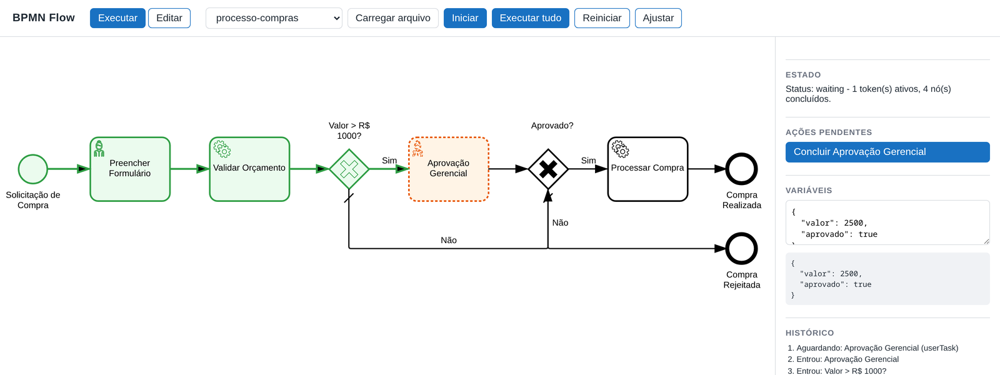
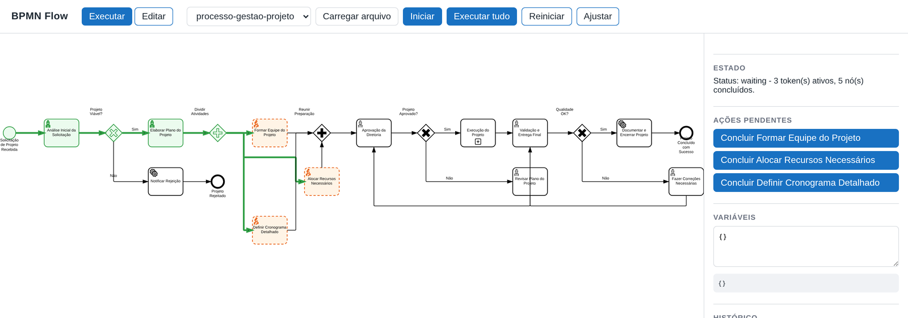
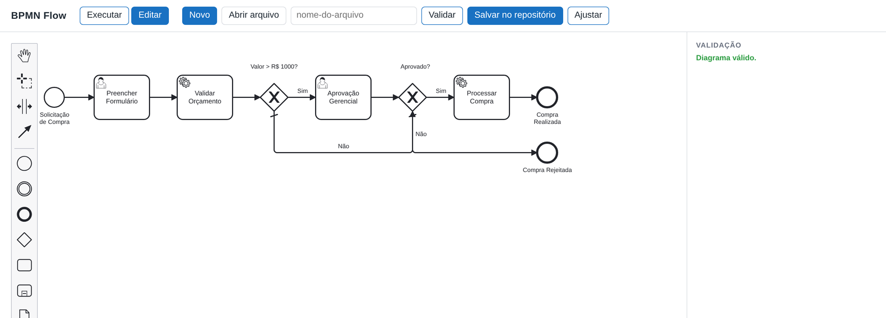

# BPMN Flow

[](https://github.com/Bappoz/bpmn-flow/actions/workflows/ci.yml)
[](LICENSE)
[](#requisitos)

Biblioteca modular para transformar diagramas BPMN 2.0 em automação de
processos. Faz o parsing do BPMN para um modelo normalizado, executa o processo
com um motor baseado em **tokens** e permite visualizar a execução de forma
interativa no navegador. Cada camada é um pacote independente e reutilizável em
qualquer projeto.

O diagrama não é documentação: a especificação da OMG define semântica de
execução para cada símbolo. É essa semântica — divisão e sincronização de
gateways, eventos de borda, escopos de subprocesso, cancelamento por terminate —
que o motor implementa.



## Índice

- [Arquitetura](#arquitetura)
- [Requisitos](#requisitos)
- [Instalação](#instalação)
- [Início rápido: usar como biblioteca](#início-rápido-usar-como-biblioteca)
- [Automação com handlers](#automação-com-handlers)
- [Visualização interativa](#visualização-interativa)
- [Playground](#playground)
- [Servidor HTTP e API REST](#servidor-http-e-api-rest)
- [Padrões BPMN suportados](#padrões-bpmn-suportados)
- [Limitações conhecidas](#limitações-conhecidas)
- [Desenvolvimento](#desenvolvimento)
- [Estrutura do repositório](#estrutura-do-repositório)
- [Licença](#licença)

## Arquitetura

O repositório é um monorepo (npm workspaces) com quatro módulos:

| Pacote                  | Responsabilidade                                                             | Ambiente       |
| ----------------------- | ---------------------------------------------------------------------------- | -------------- |
| `@bpmn-flow/core`       | Parser BPMN 2.0, modelo normalizado e motor de execução por tokens.          | Node e browser |
| `@bpmn-flow/viewer`     | Renderização interativa sobre `bpmn-visualization` com overlays de execução. | Browser        |
| `@bpmn-flow/server`     | API REST sobre o `core` e host estático para servir uma UI numa porta.       | Node           |
| `@bpmn-flow/playground` | Aplicação Vite para carregar, visualizar e executar processos no navegador.  | Browser        |

Fluxo de dados: `XML BPMN -> parseBpmn -> ProcessModel -> WorkflowEngine ->
ExecutionSnapshot -> BpmnFlowViewer`.

O `core` não depende de nenhuma biblioteca de UI, o que permite executar
processos tanto no backend quanto no frontend com o mesmo código. Detalhes de
design em [`docs/ARCHITECTURE.md`](docs/ARCHITECTURE.md); a aderência à
especificação, elemento por elemento, em
[`docs/BPMN-STANDARD.md`](docs/BPMN-STANDARD.md).

## Requisitos

- Node.js 20 ou superior
- npm 10 ou superior

## Instalação

Para desenvolver neste repositório:

```bash
npm install
npm run build
```

Os pacotes ainda **não estão publicados no npm**. Para consumi-los em outro
projeto hoje, use o repositório direto:

```bash
npm install github:Bappoz/bpmn-flow
```

Quando forem publicados, a instalação será por pacote (`@bpmn-flow/core`,
`@bpmn-flow/viewer`).

## Início rápido: usar como biblioteca

```ts
import { parseBpmn, WorkflowEngine } from '@bpmn-flow/core';

const model = await parseBpmn(xml);
const [process] = model.processes;

const engine = new WorkflowEngine(process, {
  variables: { valor: 2500 },
});

const snapshot = await engine.start();
console.log(snapshot.status); // "completed" | "waiting" | "terminated" | ...
console.log(snapshot.completedNodes);
console.log(snapshot.variables);
```

Se o processo tiver uma tarefa de usuário ou um evento de captura, a execução
pausa (`status: "waiting"`) e informa os tokens parados. Retome-a assim:

```ts
const waiting = snapshot.tokens.find((t) => t.waiting);
if (waiting?.waitReason === 'userTask') {
  await engine.completeTask(waiting.id, { aprovado: true });
} else if (waiting?.waitReason === 'catchEvent') {
  await engine.signal(waiting.nodeId);
}
```

### Pausar e retomar

A execução inteira é serializável, então um processo pode atravessar um restart,
uma fila ou um banco de dados:

```ts
const state = engine.getState(); // JSON puro: tokens, escopos, buffers de junção
await db.save(id, state);

// Em outro processo, mais tarde:
const retomado = WorkflowEngine.restore(process, await db.load(id));
retomado.registerHandler('serviceTask', handler); // handlers não são serializáveis
await retomado.completeTask(tokenId);
```

`getState()` guarda o que o `snapshot()` não guarda: contagem de chegadas em
junção paralela, tokens em espera numa junção inclusiva, alternativas armadas de
gateway baseado em evento e a árvore de escopos de subprocesso.

Exemplo executável de ponta a ponta (handler, gateway condicional e retomada de
tarefa): [`examples/quickstart.mjs`](examples/quickstart.mjs).

```bash
npm run build && node examples/quickstart.mjs
```

## Timers

Eventos de timer viram data de vencimento. O motor não tem relógio próprio: ele
calcula o vencimento e alguém decide quando conferir — o que mantém o `core`
testável e determinístico.

```ts
const engine = new WorkflowEngine(process); // `now` injetável para testes
await engine.start();

engine.nextTimerAt(); // epoch ms do próximo vencimento
await engine.tick(); // dispara o que venceu e continua a execução
```

Funciona com duração (`PT5M`), data absoluta (`2026-08-20T10:00:00Z`) e ciclo
(`R3/PT10M`, disparando uma vez), tanto em evento de captura quanto em evento de
borda — um prazo de aprovação que escala sozinho, por exemplo. O
`@bpmn-flow/server` já faz esse `tick` periodicamente.

## Repetição: multi-instância e loop

Uma atividade multi-instância roda uma vez por item de uma coleção (ou uma
quantidade fixa), em paralelo ou uma de cada vez. Cada instância ganha o **seu
próprio escopo de variáveis**, então `item` e `loopCounter` não vazam para o
processo:

```xml
<bpmn:dataObject id="itens" name="itens" />
<bpmn:dataObject id="separados" name="separados" />

<bpmn:serviceTask id="SepararItem" name="Separar Item">
  <bpmn:multiInstanceLoopCharacteristics isSequential="false">
    <bpmn:loopDataInputRef>itens</bpmn:loopDataInputRef>
    <bpmn:inputDataItem id="item" name="item" />
    <bpmn:loopDataOutputRef>separados</bpmn:loopDataOutputRef>
    <bpmn:outputDataItem id="separado" name="separado" />
  </bpmn:multiInstanceLoopCharacteristics>
</bpmn:serviceTask>
```

```ts
engine.registerHandler('SepararItem', (ctx) => ({
  separado: `${ctx.get('item')} separado`, // vira um item de "separados"
}));

const snapshot = await engine.start(); // uma instância por item de "itens"
snapshot.variables.separados; // ["teclado separado", "mouse separado", ...]
```

Variáveis seguem escopo: a leitura sobe a cadeia (instância → subprocesso →
processo) e a escrita vai para onde a variável já existe, caindo no processo
quando ela é nova. Um handler pode forçar o escopo local com `ctx.setLocal()`.

Diagrama de exemplo: [`bpmn-files/processo-pedido-itens.bpmn`](bpmn-files/processo-pedido-itens.bpmn).

## Automação com handlers

Um handler executa o trabalho real por trás de uma atividade. Registre-o por id
do elemento, por tipo de elemento ou com o coringa `*`. A resolução segue da
regra mais específica para a mais genérica.

```ts
engine.registerHandler('serviceTask', async (ctx) => {
  const total = await cobrarCartao(ctx.get('valor'));
  ctx.set('total', total);
  return { pago: true }; // valores retornados são mesclados nas variáveis
});

engine.registerHandler('reservarEstoque', (ctx) => {
  if (!temEstoque()) throw new BpmnError('SEM_ESTOQUE');
});
```

Lançar `BpmnError` dispara um evento de borda de erro (error boundary event)
correspondente, se existir. Erros comuns falham a execução.

## Visualização interativa

No navegador, combine o motor com o viewer para acompanhar a execução:

```ts
import { WorkflowEngine } from '@bpmn-flow/core';
import { BpmnFlowViewer } from '@bpmn-flow/viewer';
import '@bpmn-flow/viewer/styles.css';

const viewer = new BpmnFlowViewer({ container: 'diagram' });
viewer.load(xml);

const engine = new WorkflowEngine(process, { mode: 'automation' });
viewer.bindEngine(engine); // anima a execução ao vivo
viewer.applySnapshot(await engine.start()); // aplica o estado autoritativo
```

Estilos aplicados: nós concluídos, tokens ativos, atividades em espera e fluxos
percorridos.

Um gateway paralelo divide o fluxo em vários tokens simultâneos, e a junção só
libera quando todos chegam:



## Playground

Aplicação de demonstração com dois modos: executar e editar.

```bash
npm install
npm run build
npm run dev          # http://localhost:5173
```

No modo **executar**, escolha um diagrama de `bpmn-files/`, informe variáveis em
JSON e use `Iniciar` (pausa em cada tarefa de usuário) ou `Executar tudo`
(resolve as esperas automaticamente). O processo de compras reage às variáveis:

| Variáveis                              | Caminho                                               |
| -------------------------------------- | ----------------------------------------------------- |
| `{ "valor": 500, "aprovado": true }`   | Pula a aprovação gerencial → **Compra Realizada**     |
| `{ "valor": 2500, "aprovado": true }`  | Passa pela aprovação gerencial → **Compra Realizada** |
| `{ "valor": 2500, "aprovado": false }` | Passa pela aprovação gerencial → **Compra Rejeitada** |

No modo **editar**, o diagrama é criado com `bpmn-js`, validado pelo
`@bpmn-flow/core` e pode ser salvo no diretório de exemplos do servidor:



## Servidor HTTP e API REST

O `@bpmn-flow/server` expõe a execução por HTTP e pode servir a interface numa
porta.

```bash
npm run build
node packages/server/dist/bin.js --static apps/playground/dist --samples bpmn-files --port 3000
```

Acesse `http://localhost:3000`. Variáveis de ambiente equivalentes: `PORT`,
`STATIC_DIR`, `SAMPLES_DIR`.

Endpoints principais:

| Método e rota                     | Descrição                                        |
| --------------------------------- | ------------------------------------------------ |
| `POST /api/parse`                 | Recebe `{ xml }` e retorna o modelo normalizado. |
| `POST /api/validate`              | Valida a estrutura do diagrama.                  |
| `POST /api/sessions`              | Cria uma sessão de execução e a inicia.          |
| `GET /api/sessions/:id`           | Retorna o snapshot atual da sessão.              |
| `POST /api/sessions/:id/complete` | Conclui uma tarefa de usuário (`{ tokenId }`).   |
| `POST /api/sessions/:id/signal`   | Entrega um sinal/evento (`{ name }`).            |
| `GET /api/samples`                | Lista os arquivos `.bpmn` disponíveis.           |

Com `--data <dir>` cada sessão é gravada em disco e reconstruída sob demanda, de
modo que reiniciar o servidor não perde execuções em andamento.

## Padrões BPMN suportados

- Eventos: início, fim (none, terminate, error), intermediários de lançamento e
  de captura, e eventos de borda (interrompentes e não interrompentes).
- Definições de evento: message, timer, error, signal, escalation.
- Atividades: task, userTask, serviceTask, scriptTask, businessRuleTask,
  sendTask, receiveTask, manualTask, callActivity e subprocessos embutidos.
- Gateways: exclusivo (com fluxo default), paralelo (junção sincronizada),
  inclusivo (junção por alcançabilidade), baseado em evento e complexo.
- Repetição: multi-instância paralela e sequencial (por coleção ou cardinalidade,
  com condição de conclusão e coleção de saída) e loop padrão.
- Fluxos de sequência com condições e colaboração (pools e message flows).

## Limitações conhecidas

- **Ciclos de timer disparam uma vez**: `R3/PT10M` é lido como um intervalo de
  10 minutos, sem repetição.
- **Transações não têm rollback**: `transaction` executa como subprocesso
  comum; compensação não é executada.
- **Expressões de condição são avaliadas como JavaScript** sobre as variáveis do
  processo, assumindo que a definição do diagrama é confiável. Uma expressão que
  falha é tratada como `false` (fail-closed).
- **Compensação** é reconhecida pelo parser, mas não tem semântica de execução;
  o gateway complexo se comporta como inclusivo.
- **Call activity não executa o processo chamado**: `calledElement` é lido para
  o modelo, mas a atividade se comporta como uma tarefa comum (pass-through, ou
  o que um handler registrado fizer).
- **Sinal não é broadcast**: `signal()` entrega ao primeiro evento de captura
  correspondente, enquanto a especificação difunde para todos.

## Desenvolvimento

```bash
npm run build       # compila todos os pacotes
npm test            # executa a suíte Vitest
npm run typecheck   # checagem de tipos em todo o monorepo
npm run lint        # ESLint
npm run format      # Prettier
npm run dev         # sobe o playground em modo de desenvolvimento
```

O CI roda `format:check`, `lint`, `typecheck`, `test` e `build` no Node 20 e 22.

## Estrutura do repositório

```
packages/
  core/        modelo, parser e motor de execução
  viewer/      renderização interativa com overlays
  server/      API REST e host estático
apps/
  playground/  aplicação interativa (Vite)
examples/      scripts executáveis de uso da biblioteca
bpmn-files/    diagramas .bpmn de exemplo
docs/          documentação complementar
```

## Licença

MIT. Veja [LICENSE](LICENSE).
